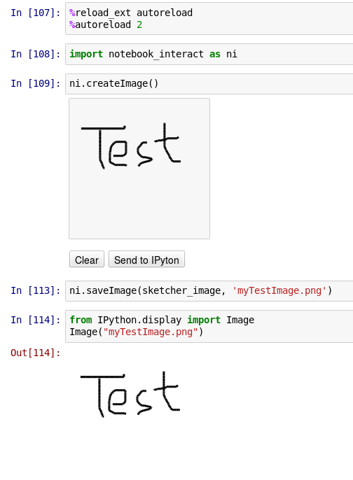

# notebook_interact
This repository contains some input methods to create content directly in your IPython notebook.

Use it my cloning the repository.

Then navigate your IPython notebook to the repository folder and open the UsageExample.

The JS code is based on this demo: [HTML5-Canvas-Brush-Sketch](https://github.com/triceam/HTML5-Canvas-Brush-Sketch)
